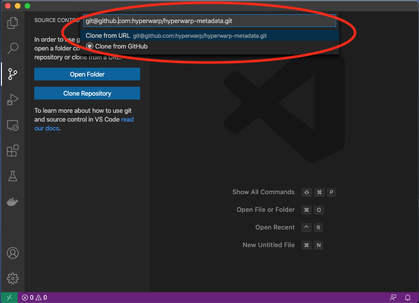
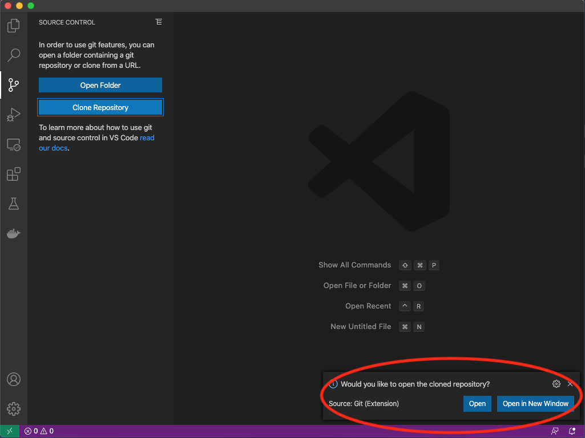
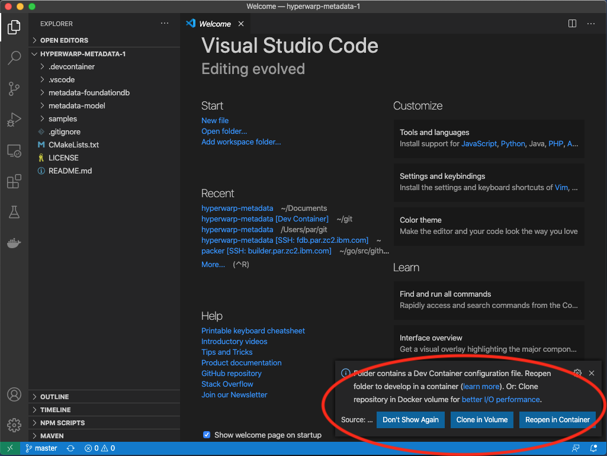

# Hyperwarp Metadata

## Dependencies

This build requires a C compiler like GCC, [CMake](https://cmake.org), [FoundationDB](https://github.com/apple/foundationdb), [protobuf-c](https://github.com/protobuf-c/protobuf-c) to be installed on your machine.

## Build

First, after cloning this repository run CMake to generate the build files:

```bash
$ cmake .
-- Configuring done
-- Generating done
-- Build files have been written to: /home/ubuntu/hyperwarp-metadata
$
```

Now you can run `make` to build the source code:

```bash
$ make
[ 33%] Built target hyperwarp-metadata-model
[ 66%] Built target hyperwarp-metadata-fdb
[100%] Built target hyperwarp-metadata
$
```

The build will output the binary files into the `bin` folder in a structure like this:

```
bin/
    metadata-foundationdb/
        libhyperwarp-metadata-fdb.so
    metadata-model/
        libhyperwarp-metadata-model.so
    samples/
        metadata-sample
```

You can run `sudo make install` to install the shared libraries into `/usr/local/lib` and the header files to `/usr/local/include/hyperwarp`.

```bash
$ sudo make install
[ 30%] Built target hyperwarp-metadata-model
[ 50%] Built target hyperwarp-metadata-fdb
[ 70%] Built target hyperwarp-metadata
[100%] Built target metadata-sample
Install the project...
-- Install configuration: "Debug"
-- Installing: /usr/local/lib/libhyperwarp-metadata-model.so
-- Installing: /usr/local/include/hyperwarp/metadata.pb-c.h
-- Installing: /usr/local/lib/libhyperwarp-metadata-fdb.so
-- Set runtime path of "/usr/local/lib/libhyperwarp-metadata-fdb.so" to ""
-- Installing: /usr/local/include/hyperwarp/metadata-foundationdb.h
-- Installing: /usr/local/lib/libhyperwarp-metadata.so
-- Set runtime path of "/usr/local/lib/libhyperwarp-metadata.so" to ""
-- Installing: /usr/local/include/hyperwarp/metadata.h
$
```

## Run the samples using the development container

### Using VS Code

1. Clone this repository with VS Code



2. When prompted, select to open the cloned repository in VS Code



3. When prompted, select to "Reopen in Container" or "Clone in Volume"



4. Open a Terminal within VS Code and build the code as described [above](README.md#build)

5. Start a local FoundationDB server by running `sudo service foundationdb start` inside the container.

6. Run the samples, e.g. `./bin/samples/metadata-sample`

```bash
$ ./bin/samples/metadata-sample
Printing MetaData
  Printing 10 PhysicalDisks
    PhysicalDisk
      Key = 8473c628-dd82-4517-83e1-d6e4289eee27
      Sector Count = 266144
      Sector Size = 4096
      NQN = nqn.2020-11.com.github.hyperwarp:cnode7
      Disk ranges unallocated = 1
      Disk ranges allocated = 3
    PhysicalDiskRanges
      unallocated
        8473c628-dd82-4517-83e1-d6e4289eee27 / c1536828-ba22-411a-858a-e87a63811dfd
      allocated
        8473c628-dd82-4517-83e1-d6e4289eee27 / a59ca1fa-8379-444d-ad65-8d15c4c3db2d
        8473c628-dd82-4517-83e1-d6e4289eee27 / 7fe22dcf-6fc5-4daa-aaa8-db2b55c9b69a
        8473c628-dd82-4517-83e1-d6e4289eee27 / be46b631-005d-4a0f-ac92-dc3f2828eb1a
    ...
  PhysicalDisks END
  Printing 2 VirtualDisks
    VirtualDisk
      Key = c626c6f2-49ec-4f36-bd08-4b0703d9075b
      Name = vdisk1
      Size = 3 GB
      Erasure Code Profile = EC_4_2P
      VirtualDiskRanges
        c626c6f2-49ec-4f36-bd08-4b0703d9075b / 56afb3ce-81c6-43b8-8018-c054fb3696ba
          PhysicalDiskRanges
          ...
  VirtualDisks END
Tada!
$
```

### Manually

1. Clone this repository

```bash
git clone git@github.ibm.com:hyperwarp/hyperwarp-metadata.git
```

2. From within the cloned folder, pull the development container image for Linux amd64 from [Docker Hub](https://hub.docker.com/r/hyperwarp/devcontainer) and run it while mounting the cloned source code folder into the container.

```bash
docker run -it -v $(pwd):/root/hyperwarp-metadata hyperwarp/devcontainer:latest
```

2. Build the code as described [above](README.md#build).
3. Start a local FoundationDB server by running `sudo service foundationdb start` inside the container.
4. Run the samples, e.g. `./bin/samples/metadata-sample`

```bash
$ ./bin/samples/metadata-sample
Printing MetaData
  Printing 10 PhysicalDisks
    PhysicalDisk
      Key = 8473c628-dd82-4517-83e1-d6e4289eee27
      Sector Count = 266144
      Sector Size = 4096
      NQN = nqn.2020-11.com.github.hyperwarp:cnode7
      Disk ranges unallocated = 1
      Disk ranges allocated = 3
    PhysicalDiskRanges
      unallocated
        8473c628-dd82-4517-83e1-d6e4289eee27 / c1536828-ba22-411a-858a-e87a63811dfd
      allocated
        8473c628-dd82-4517-83e1-d6e4289eee27 / a59ca1fa-8379-444d-ad65-8d15c4c3db2d
        8473c628-dd82-4517-83e1-d6e4289eee27 / 7fe22dcf-6fc5-4daa-aaa8-db2b55c9b69a
        8473c628-dd82-4517-83e1-d6e4289eee27 / be46b631-005d-4a0f-ac92-dc3f2828eb1a
    ...
  PhysicalDisks END
  Printing 2 VirtualDisks
    VirtualDisk
      Key = c626c6f2-49ec-4f36-bd08-4b0703d9075b
      Name = vdisk1
      Size = 3 GB
      Erasure Code Profile = EC_4_2P
      VirtualDiskRanges
        c626c6f2-49ec-4f36-bd08-4b0703d9075b / 56afb3ce-81c6-43b8-8018-c054fb3696ba
          PhysicalDiskRanges
          ...
  VirtualDisks END
Tada!
$
```
